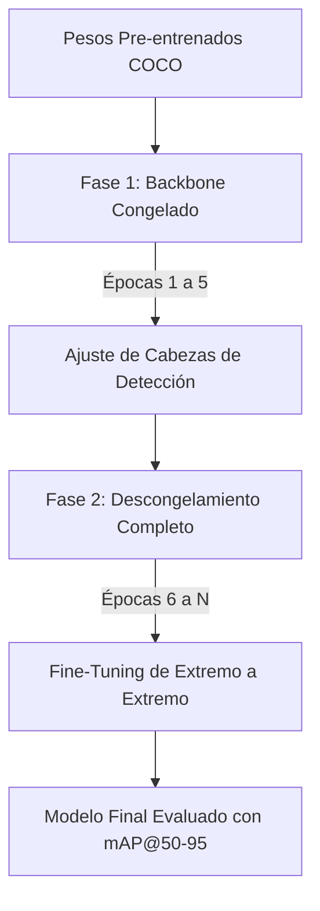

# Reporte Técnico: Explicación de lo Realizado en YOLO26

## 1. Introducción y Contexto

El objetivo principal de esta etapa del proyecto es la implementación del pipeline de entrenamiento para el modelo de visión por computadora **YOLO26** (basado en la evolución de arquitecturas YOLO de detección en tiempo real) enfocado en el reconocimiento y localización de defectos en superficies de madera.

El entrenamiento está diseñado para ejecutarse en la plataforma **Kaggle** utilizando la infraestructura acelerada por hardware de dos tarjetas gráficas **NVIDIA T4 (2x GPUs)**, garantizando un balance óptimo entre convergencia del modelo, eficiencia computacional y tiempo total de ejecución (estimado entre **3 y 5 horas**).

---

## 2. Arquitectura del Modelo y Transfer Learning

Para lograr un aprendizaje rápido y robusto a partir de pocas imágenes o sin requerir cientos de épocas desde cero, se aplicó la técnica de **Transfer Learning** partiendo de pesos pre-entrenados en el dataset masivo **COCO (Common Objects in Context)**.

### Estrategia de Selección de Variantes:
Se contemplaron 3 variantes principales según la capacidad computacional y los requerimientos de tiempo:
1. **YOLO26-Small (`yolo26s` / `yolo11s`)**: ~9.4M de parámetros. Opción preferida para entrenamientos ultra rápidos (~2.5 a 3.5 horas en 2x T4).
2. **YOLO26-Medium (`yolo26m` / `yolo11m`)**: ~20.1M de parámetros. Opción balanceada (~3.5 a 4.5 horas).
3. **YOLO26-Large (`yolo26l` / `yolo11l`)**: ~25.3M de parámetros. Mayor capacidad de representación (>4.5 horas).

---

## 3. Estrategia de Entrenamiento en 2 Fases (Backbone Freeze/Unfreeze)

Para evitar la degradación de los mapas de características pre-entrenados al ajustar la red a un dominio nuevo (madera y sus 8 tipos de defectos), el proceso se dividió en dos fases controladas:

### Fase 1: Congelamiento de Capas de Extracción (Backbone Freeze)
- **Duración**: Épocas 1 a 5.
- **Mecanismo**: Se congelan las capas 0 a 9 (el Backbone extractor de características) fijando sus gradientes (`requires_grad = False`).
- **Propósito**: Permitir que únicamente las cabezas de detección (Detection Head) aprendan las combinaciones lineales de los defectos de madera, previniendo la destrucción de pesos útiles aprendidos en COCO (*catastrophic forgetting*).

### Fase 2: Fine-Tuning de Extremo a Extremo (Unfreeze)
- **Duración**: Épocas 6 hasta el final (o hasta activar Early Stopping).
- **Mecanismo**: Se liberan todos los parámetros de la red (`freeze=0`).
- **Propósito**: Adaptación fina de los mapas de características de bajo y alto nivel a las texturas, grietas y nudos específicos de las tablas de madera.

---

## 4. Configuración Estricta Baseline (Sin Aumentación ni Redimensionamiento)

Por especificación del proyecto para esta primera iteración:
1. **Invariabilidad de Dimensiones (`rect=True`)**: Se activa el entrenamiento rectangular (*Rectangular Training*). Las imágenes se agrupan en lotes ajustando el relleno minimalista según la relación de aspecto original de cada imagen, evitando distorsiones espaciales o forzar redimensionamientos cuadrados arbitrarios.
2. **Sin Augmentación de Datos**: Se desactivaron completamente los parámetros de aumentación fotométrica y geométrica (`augment=False`, `hsv_h=0`, `hsv_s=0`, `hsv_v=0`, `degrees=0`, `translate=0`, `scale=0`, `shear=0`, `perspective=0`, `flipud=0`, `fliplr=0`, `mosaic=0.0`, `mixup=0.0`, `copy_paste=0.0`). Esto asegura una evaluación *baseline* pura del rendimiento nativo del algoritmo sobre el dataset original.

---

## 5. Estimación Dinámica de Tiempo con `tqdm` y Early Stopping

1. **Monitoreo con `tqdm`**: A partir de la **2da época**, la clase `EpochTimerCallback` calcula el tiempo promedio por época $\bar{t}$ descartando el overhead inicial de compilación y calentamiento.
2. **Proyección en Tiempo Real**:
   $$\text{Tiempo Total Estimado (h)} = \frac{\bar{t} \times \text{Total Épocas}}{3600}$$
   Si el estimado supera las 5 horas, la consola emite una advertencia recomendando reducir las épocas o migrar a una variante más ligera.
3. **Early Stopping**: Si la métrica de validación no mejora durante **15 épocas consecutivas** (`patience=15`), el entrenamiento se detiene automáticamente reteniendo los mejores pesos guardados en `best.pt`.
